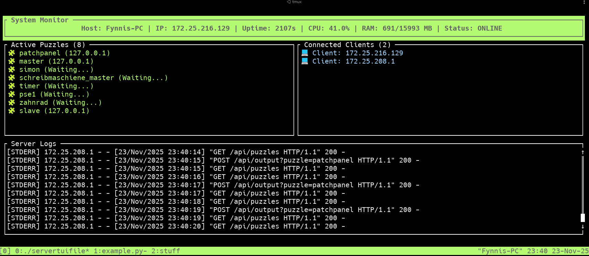

# Escape Room - Server TUI

Ein serverbasiertes Text-User-Interface (TUI) für die Verwaltung eines Escape Rooms, geschrieben in Rust. Es handelt es sich hierbei um einen Wrapper um eine bestehende ```server.py```. Die Inputs dieser Datei werden die simple Verarbeitung aufgearbeitet und in der TUI übersichtlicher angezeigt.

## Übersicht

Dieses Projekt stellt ein in Rust geschriebenes TUI dar, welches als Wrapper um eine Python-File argiert und deren Outputs weiterverarbeitet und übersichtlich für alle Nutzer darstellt.

## Funktionen

*   **Rätsel-Überwachung:** Zeigt den aktuellen Status der Rätsel und deren IP-Adressen an.
*   **Zeit-Management:** Zeigt Informationen über Uptime vom Server und zukünftig auch die Zeit vom Spiel an.
*   **Logs:** Zeigt die Logs des Servers an.
*   **Informationen:** Zeigt alle für einen User wichtigen Informationen an, wie bspw. Hostname, IP-Adresse und weitere Informationen.

## Screenshot



## Installation & Start

Detaillierte Anweisungen, wie das Projekt kompiliert und der Server gestartet wird.

```bash
# Klonen des Repositories
git clone https://github.com/FynnHer/escaperoom-servertui.git
cd escaperoom-servertui

# Kompilieren
cargo build --release

# Starten des Servers
./target/release/escaperoom-servertui
```

## Mitwirken

Beiträge sind willkommen! Bitte öffne einen Issue, um Fehler zu melden oder neue Funktionen vorzuschlagen.

## Lizenz

Dieses Projekt steht unter der [MIT-Lizenz](LICENSE).
